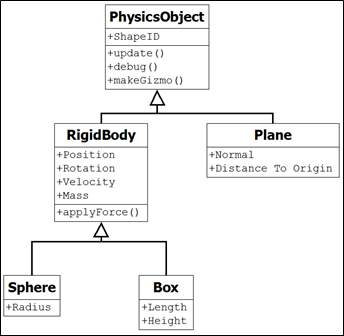

# Tutorial – Linear Force and Momentum
## Introduction and Objective:
In this tutorial we will add a Circle class to our simulation, which extends the PhysicsObject abstract class we implemented in the previous tutorial.

We will also implement some basic movement, collision detection, and collision response, so that we can give our Circles some initial velocity and watch them collide.


## Prerequisites:
You will need to have completed the following tutorials:

***Fixed Timestep Tutorial – available under the Introduction to Physics session.***
 

## Physics Objects:
For our purposes, you can assume that each physics object (or actor) in the scene has a single collision volume and that there are initially only three types:

- Plane
- Circle
- Box


The actors in a physics engine can be static or dynamic.  Static objects do not move so only need position and orientation (remember this is 2D so we need a vec2 for position and single float for the orientation angle).  The Plane can only be static (it makes no sense for something with infinite extents and infinite thickness to move about in our scene)

 

Dynamic actors have some additional properties:

- Mass
- Velocity


The following [UML Class Diagram](https://aie.instructure.com/courses/808/pages/Code%20Design%20and%20Data%20Structures%20-%20UML?titleize=0 "To learn more about what UML Diagrams are, please look back at the optional learning of Year 1") illustrates the complete actor class hierarchy that we will implement in our physics engine:



Note how everything is derived from a single base class, the *PhysicsObject* class we implemented in the previous tutorial. This design choice was made so that we can iterate through a single list when updating and adding gizmos to our scene. This will also allow us to write our collision detection routines in a neater form later on. 

In this tutorial we’ve updated the *PhysicsObject* class to include a single variable: ShapeID.  This is used for collision detection in a later tutorial.  The code will be neater if you use an enumerated type for this.

Your updated definition for the *PhysicsObject* class is as follows:

```c++
enum ShapeType {
    PLANE = 0,
    Circle,
    BOX
};

class PhysicsObject {
protected:
    PhysicsObject(ShapeType a_shapeID) : m_shapeID(a_shapeID) {}

public:
    virtual void FixedUpdate(glm::vec2 gravity, float timeStep) = 0;
    virtual void Draw() = 0;
    virtual void ResetPosition() {};

protected:
    ShapeType m_shapeID;
};
```

You will need a ‘getter’ to return the m_shapeID.

In this tutorial we will only create the *RigidBody* and *Circle* sub-classes. You may wish to start defining the Box and Plane class yourself now, although we will cover these in a future tutorial.

## The RigidBody Class:
All dynamic actors will inherit from the *RigidBody* class. Because this class will serve as a base class for any kind of dynamic actor (Circle, Box, or any other shape that may be added in the future), it will encapsulate the variables relating to movement and position.

Create the new *RigidBody* class and update the class definition as follows:

```c++
class Rigidbody : public PhysicsObject {
public:
    Rigidbody(ShapeType shapeID, glm::vec2 position, 
            glm::vec2 velocity, float orientation, float mass);
    ~Rigidbody();

    virtual void FixedUpdate(glm::vec2 gravity, float timeStep);
    void ApplyForce(glm::vec2 force);
    void ApplyForceToActor(Rigidbody* actor2, glm::vec2 force);

    glm::vec2 GetPosition() { return m_position; }
    float GetOrientatation() { return m_orientation; }
    glm::vec2 getVelocity() { return m_velocity; }
    float GetMass() { return m_mass; }

protected:
    glm::vec2 m_position;
    glm::vec2 m_velocity;
    float m_mass;
    float m_orientation;    //2D so we only need a single float to represent our orientation
};
```

Start by implementing the constructors, which should initialize the member variables.

The *ApplyForce()* function is where we apply Newton’s second law. This function will modify the velocity of the object according to the object’s mass and how much force has been applied.

Applying a force to an object will either speed it up or slow it down. That is to say, applying a force will change the acceleration of an object. By adding the acceleration to the current velocity, we find the object’s new velocity.

As you would recall from the lecture, according to Newton’s Second Law acceleration is calculated by dividing force by mass (a = F/m). So, in the *ApplyForce()* function you will need to calculate acceleration and add it to the m_velocity member variable. You should be able to write this as one line of code.

The *ApplyForceToActor()* function prototype is a variation of the *ApplyForce()* function.  It allows us to simulate one actor “pushing” another.

You may recall Newton’s third law, which states “for every action, there is an equal and opposite reaction”. In the *ApplyForceToActor()* function you must first apply the input force to the input actor (by calling the *ApplyForce()* function of that actor), and then apply the opposite force to the current actor (by calling *ApplyForce()* on this using the negative force).

Finally, the *FixedUpdate()* function will apply any forces to the actor (i.e., gravity) before calculating the final position.

In this engine we’re passing the gravity as an argument each time we call the Rigidbody’s *FixedUpdate()* function. The gravity can be set when the application launces, and will be either zero (for a top-down pool table simulation) or non-zero (for an Angry Birds style game). Apply it as a force, but multiply by the object’s mass first so that it acts as a pure acceleration. We’ll divide by mass again inside our *ApplyForce()* function as per Newton’s Second Law.

After applying gravity as a force, we add the updated vector to the actor’s position to get the new position of the actor.

```c++
void Rigidbody::FixedUpdate(glm::vec2 gravity, float timeStep)
{
    m_position += m_velocity * timeStep;
    ApplyForce(gravity * m_mass * timeStep);
}
```

Whether we apply the force of gravity before or after updating the position, we introduce a systematic error into our physics simulation. For now its preferable to apply gravity afterwards. We’ll return to this point later when we have enough features to test it properly.
 

## The Circle Class:
The definition for the Circle class is as follows:

``` c++
class Circle : public Rigidbody
{
public:
    Circle(glm::vec2 position, glm::vec2 velocity, 
        float mass, float radius, glm::vec4 colour);
    ~Circle();

    virtual void Draw();

    float GetRadius() { return m_radius; }
    glm::vec4 GetColor() { return m_color; }

protected:
    float m_radius;
    glm::vec4 m_color;
};
``` 

We have a single constructor which allows us to instantiate an actor in our scene with a starting position, velocity, mass radius and color. Make sure you call the base class (Rigidbody) constructor, passing in the appropriate shape type. This is the constructor definition for the *Circle* class, other shape classes will be similar:

```c++
Circle::Circle(glm::vec2 position, glm::vec2 velocity, float mass, float radius, glm::vec4 color) : 
    Rigidbody(Circle, position, velocity, 0, mass)
{
    m_radius = radius;
    m_color = color;
}
```
In the definition of the class, note how we have not added the *FixedUpdate(), ApplyForce()* or *ApplyForceToActor()* functions. These are implemented in the rigid body class, and as they will always be the same for all sub-classes, we won’t need to overload them here. However, because all our shape sub-classes require a different type of gizmo to represent them visually, it makes sense to provide them with unique Draw() functions.

The draw function will simply call the *add2DCircle()* function of the Gizmo class, passing in the appropriate arguments. This is a static function, and don’t forget that the Gizmo class is defined within the aie namespace.

For now, you don’t need to derive classes for the plane or the boxes.  All our experiments with Newton’s laws of motion and the projectile physics will be done with Circles.

## The PhysicsScene Class:
We want to update our PhysicsScene class to check for collisions between all the Circles in our simulation.

Ideally, we’d want to implement some sort of spatial partitioning system to help optimize the number of collision checks we need to perform. However, for our purposes, a simple nested for loop will suffice (although you definitely wouldn’t want to use this in any sort of real application).

Add the following code to your PhysicsScene::update() function:

```c++
void PhysicsScene::Update(float dt) {

    // update physics at a fixed time step
    static float accumulatedTime = 0.0f;
    accumulatedTime += dt;

    while (accumulatedTime >= m_timeStep) {
        for (auto pActor : m_actors) {
            pActor->FixedUpdate(m_gravity, m_timeStep);
        }
        accumulatedTime -= m_timeStep;

        // check for collisions (ideally you'd want to have some sort of 
        // scene management in place)
        int actorCount = m_actors.size();

        // need to check for collisions against all objects except this one.
        for (int outer = 0; outer < actorCount - 1; outer++)
        {
            for (int inner = outer + 1; inner < actorCount; inner++)
            {
                PhysicsObject* object1 = m_actors[outer];
                PhysicsObject* object2 = m_actors[inner];
                
                // for now we can assume both shapes are Circles, 
                // since that is all we’ve implemented for now.
                Circle2Circle(object1, object2);
            }
        }
    }
}
```
Note how the second for loop starts at outer+1 rather than 0. We only want to compare each pair of objects once rather than twice, and we don’t want to compare each object against itself

The Circle2Circle function is a static function of PhysicsScene. We’ll be adding more of these in later tutorials to cover the different code we need for checking collisions between different types of primitives.

```c++
static bool Circle2Circle(PhysicsObject*, PhysicsObject*);
```

In the function implementation, we cast both PhysicsObjects to Circles and determine whether they’ve collided or not by examining their positions and radii.

We’ll implement physically realistic collision response later, where the balls bounce off each other based on velocity and mass. For now, we can just set both velocities to zero.

We need to test the collision detection routine, and this will be an unambiguous visual indiciation when both balls stop completely when they touch.

```c++
bool PhysicsScene::Circle2Circle(PhysicsObject* obj1, PhysicsObject* obj2)
{
    // try to cast objects to Circle and Circle
    Circle* sphere1 = dynamic_cast<Circle*>(obj1);
    Circle* sphere2 = dynamic_cast<Circle*>(obj2);
    // if we are successful then test for collision
    if (sphere1 != nullptr && sphere2 != nullptr)
    {
        // TODO do the necessary maths in here
        // TODO if the Circles touch, set their velocities to zero for now
    }
}
```
You can calculate the distance between the two centres manually, or use the helper function *glm::distance* and pass the Circle centers in.

Compare this distance to the sum of the radii to determine whether a collision has taken place.

As a final bit of housekeeping, now that we’ll be adding actors to our m_actors vector, we’ll want to ensure that we’re deallocating our memory correctly when cleaning up our scene. Ensure you are deleting any objects in the scene in the scene destructor like so.

``` c++
PhysicsScene::~PhysicsScene()
{
    for (auto pActor : m_actors)
    {
        delete pActor;
    }
}
```

## Activity 1: Demonstrating Newton’s First Law
We’ll start by demonstrating Newton’s first law – ***an object in motion will remain in motion until acted upon by an external force***.

To do this we’ll turn off gravity, add a single Circle to our scene, and give our Circle an initial velocity. The Circle should remain travelling at a constant speed in a fixed direction.

Update the startup() function of your application class as follows:

``` c++
bool PhysicsApp::startup() {
    // increase the 2d line count to maximize the number of objects we can draw
    aie::Gizmos::create(255U, 255U, 65535U, 65535U);

    m_2dRenderer = new aie::Renderer2D();

    m_font = new aie::Font("./font/consolas.ttf", 32);

    // initialize the physics scene
    m_physicsScene = new PhysicsScene();
    m_physicsScene->SetGravity(vec2(0, 0));
    m_physicsScene->SetTimeStep(0.01f);

    Circle* ball;
    ball = new Circle(vec2(-40, 0), vec2(10, 30), 3.0f, 1, vec4(1, 0, 0, 1));
    m_physicsScene->AddActor(ball);
    return true;
}
```

Compile and execute your program to see Newton’s first law at work.

## Activity 2: Demonstrating Newton’s Second Law

Newton’s second law – ***When a body is acted upon by a force, the time rate of change of its momentum equals the force.***.

To simulate Newton’s second law, simply set the gravity to a non-zero value, for example (0,-10).  In this case the actor should move in a parabolic path simulating the movement of a projectile.  Applying a force to the actor whilst the simulation is running further demonstrates the second law.

## Activity 3: Demonstrating Newton’s Third Law:

Finally, Newton’s third law – ***If two bodies exert forces on each other, these forces have the same magnitude but opposite directions.***.

Newton’s third law is trickier to demonstrate. For this, we will use the Rigidbody::ApplyForceToActor() function. 

To demonstrate Newton’s third law, instantiate two Circles of the same mass and radius next to each other in the centre of the screen. 

In the application’s update() function scan for a key press. When the key is pressed use the ApplyForceToActor() to apply a force, once, to one of the actors. Alternatively, call the ApplyForceToActor() function at the end of the startup() function, leaving the update() function unmodified.

The force you apply must be towards the second actor.  You should find that the two actors move away from each other with equal velocities.

Repeat the experiment but try it with Circles of different masses.

```c++
    m_physicsScene->SetGravity(vec2(0, 0));  // turn off gravity

    Circle* ball1 = new Circle(vec2(-4, 0), vec2(0, 0), 4.0f, 4, vec4(1, 0, 0, 1));
    Circle* ball2 = new Circle(vec2(4, 0), vec2(0, 0), 4.0f, 4, vec4(0, 1, 0, 1));

    m_physicsScene->AddActor(ball1);
    m_physicsScene->AddActor(ball2);

    ball1->ApplyForceToActor(ball2, vec2(-2, 0));
```

## Activity 4: Simulating a Collision:
For this simulation, create two Circles some distance apart on the screen. Give each Circle an initial velocity such that it moves towards the other Circle. After some time the Circles will collide (the collision will be detected by the placeholder collision, and both balls should stop completely when they touch).

```c++
    // turn off gravity
    m_physicsScene->SetGravity(vec2(0, 0));

    Circle* ball1 = new Circle(vec2(-20, 0), vec2(0), 4.0f, 4, vec4(1, 0, 0, 1));
    Circle* ball2 = new Circle(vec2(10, 0), vec2(0), 4.0f, 4, vec4(0, 1, 0, 1));

    m_physicsScene->AddActor(ball1);
    m_physicsScene->AddActor(ball2);

    ball1->ApplyForce(vec2(30, 0));
    ball2->ApplyForce(vec2(-15, 0));
```

## Activity 5:  Simulating a Rocket Motor:
Finally, you can simulate a simple rocket motor. Create a Circle in the centre of the screen, this is the rocket. Set gravity to zero. In the update function, at time intervals, you need to:

- Reduce the mass of the rocket by M to simulate fuel being used
- Create a new Circle of mass M next to the rocket to simulate an exhaust gas particle (ensuring that the two Circles won’t collide – in fact, this simulation will work better if you turn off collision detection altogether)
- Use ApplyForceToActor() to apply force to the exhaust gas from the rocket (make sure it is in the correct direction)
Repeat until all the mass has been used up
- You will need to experiment with different forces and masses, firing rate, to make it work properly. 

For added effect make the exhaust gas particles smaller than the rocket and a different colour.  

### Extension
- Try turning gravity on and see if you can get the rocket to lift off against gravity. 
- Try changing the direction of the force you apply to steer the rocket around the screen.


## Next Tutorial:
Collision Detection in Collision Detection section