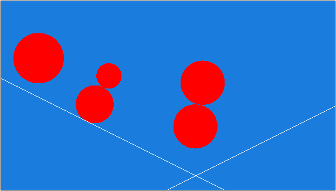
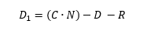

# Tutorial – Collision Detection


 

## Introduction and Objective:
In this tutorial we introduce simple collision detection in our engine. We will start with Circle-to-Circle collision detection, then add Circle-to-Plane. Finally, we will add boxes and add collision detection for those using the separate axis theorem.

We won't add collision response at this stage, our objects will simply stop after a collision.
 

## Prerequisites:
We are going to be using the DIY Physics engine that you have been writing.

Ensure you have completed the following tutorials:
- ***Fixed Timestep Tutorial. Available in the Introduction to Physics session.***
- ***Linear Force and Momentum Tutorial. Available in the Linear Force and Momentum session.***

Although recommended, it is not necessary to have completed the following previous tutorials:
- ***Projectile Physics part 1: Analytical Solution. Available in the Projectile Physics session.***
- ***Projectile Physics part 2: Numerical Integration. Available in the Projectile Physics session.***
 

## Adding a Plane Class:
If you have not already done so you need derive a plane object and provide a way to add it to your scene. A plane different from a normal rigid body as it has infinite extents and it usually makes no sense for it to be dynamic. It's a good object to have in our physics engine though because it's relatively easy to work with.

The best way to represent it is as a surface normal and a minimum distance from the plane to the origin. These two pieces of information (the surface normal and distance from the origin) fix the plane’s position in space.  Because our plane is 2D we use a glm::vec2 for the normal.

The plane is one-sided, and considered to extend to infinity along both it’s edge and backwards from its normal direction. This is simpler to write than a two-sided plane, and also less susceptible to numerical instability issues.

The following is a suitable class definition for the plane: 

``` c++
class Plane : public PhysicsObject
{
public:
    Plane(glm::vec2 normal, float distance);
    ~Plane();

    virtual void FixedUpdate(glm::vec2 gravity, float timeStep);
    virtual void Draw();
    virtual void ResetPosition();

    glm::vec2 GetNormal() { return m_normal; }
    float GetDistance() { return m_distanceToOrigin; }

protected:
    glm::vec2 m_normal;
    float m_distanceToOrigin;
};
```

The implementation of all of these functions, excepting the Draw() function, are all relatively trivial. Because all plane objects will be static, the FixedUpdate() function will be empty. The other functions will simply set various member variables. You should be able to complete these by yourself.

Of course, the draw() function must add a suitable gizmo to represent the plane. Because planes are infinite in size this is slightly tricky to do. The following function is a simple way of generating to represent the plane in 2D. If you zoom the camera out a long way you may need to increase the length of the line.

The colourFade colour in the code below is a zero-alpha copy of the colour used to draw the plane.

This gives the plane a solid edge that fades away to nothing behind it.

``` c++
void Plane::Draw()
{
    float lineSegmentLength = 300;
    glm::vec2 centerPoint = m_normal * m_distanceToOrigin;
        // easy to rotate normal through 90 degrees around z
    glm::vec2 parallel(m_normal.y, -m_normal.x);
    glm::vec4 colourFade = m_colour;
    colourFade.a = 0;
    glm::vec2 start = centerPoint + (parallel * lineSegmentLength);
    glm::vec2 end = centerPoint - (parallel * lineSegmentLength);
    //aie::Gizmos::add2DLine(start, end, colour);
    aie::Gizmos::add2DTri(start, end, start - m_normal*10.0f, m_colour, m_colour, colourFade);
    aie::Gizmos::add2DTri(end, end - m_normal * 10.0f, start - m_normal * 10.0f, m_colour, colourFade, colourFade);
}
```

Now that we have moving circles and a plane we can start thinking about our collision routine. In later lectures we optimize the process but for now we'll use a brute force approach and test collision between every pair of objects.

 

## Calling the Correct Collision Detection Routine:
We need a way to pick the correct collision detection routine based on the pair of objects which are colliding. When two circles collide then we need to call the Circle2Circle collision routine, but if a Circle strikes a plane we need Circle2Plane.

Before we can pick the correct routine we need a way to identify what types of objects are involved in the collision.

C++ provides methods for us to determine the type of a derived class at run time (like dynamic casting) but these are slow. What would be preferable is an integral type identifier (like an enum).

This is where the shapeID variable we added earlier comes in.  We will use it to identify what type of object is colliding. The advantage of using an enumerated type over a series of hard-coded integers is that it will make our code easier to read.

When we call the base class constructor in our derived shape classes, we'll pass in the shapeID for the appropriate object.

You should have already done this when implementing your Circle class. Here it is again for the default constructor of the Plane class:
``` c++
Plane::Plane() : PhysicsObject(ShapeType::PLANE) {
    m_distanceToOrigin = 0;
    m_normal = glm::vec2(0, 1);
}
```
Now, when we check for collisions between pairs of objects, we can use their shapeID to pick the appropriate collision detection routine. 

One way to implement this is by using a nested switch statement. But this rapidly becomes unwieldy to code and difficult to maintain.  The following code illustrates how quickly this happens even with just circles and planes (you don’t need this code, it’s just here to illustrate a point!):

(**Note: don’t put this code in your program, we’re illustrating the wrong way to implement this**)

```
// DO NOT USE THE FOLLOWING
void PhysicScene::checkForCollisionUsingSwitch() {
    int actorCount = m_actors.size();
    //need to check for collisions against all objects except this one.
    for (int outer = 0; outer < actorCount - 1; outer++) {
        for (int inner = outer + 1; inner < actorCount; inner++) {
            PhysicsObject* object1 = m_actors[outer];
            PhysicsObject* object2 = m_actors[inner];
            ShapeType shapeID1 = object1->m_shapeID;
            ShapeType shapeID2 = object2->m_shapeID;
            switch (shapeID1) {
                case PLANE:
                       switch (shapeID2) {
                        case PLANE:
                            Plane2Plane(object1, object2);
                            break;
                        case CIRCLE:
                            Plane2Circle(object1, object2);
                            break;
                    }
                    break;
                case CIRCLE:
                    switch (shapeID2) {
                        case PLANE:
                            Plane2Plane(object1, object2);
                            break;
                        case CIRCLE:
                            Plane2Circle(object2, object1);
                            break;
                    }
                    break;
            }
        }
    }
}
// DO NOT USE THE FOLLOWING
```

A much neater solution is to use an array of function pointers. 

We then combine the shapeID of actor1 and the shapeID of actor2 to form an index into the array. This provides a function pointer for the function we need to perform the correct type of collision.   We call the function and pass pointers two actors into it.

The following code shows the complete collision detection function using an array of function pointers. Replace the hardcoded call to Circle2Circle we had inside PhysicScene::update with this function pointer based approach.

``` c++
// function pointer array for doing our collisions
typedef bool(*fn)(PhysicsObject*, PhysicsObject*);

static fn collisionFunctionArray[] =
{
    PhysicsScene::Plane2Plane, PhysicsScene::Plane2Circle,
    PhysicsScene::Circle2Plane, PhysicsScene::Circle2Circle, 
};

void PhysicsScene::Update(float dt)
{
...
    int actorCount = m_actors.size();

    //need to check for collisions against all objects except this one.
    for (int outer = 0; outer < actorCount - 1; outer++)
    {
        for (int inner = outer + 1; inner < actorCount; inner++)
        {
            PhysicsObject* object1 = m_actors[outer];
            PhysicsObject* object2 = m_actors[inner];
            int shapeId1 = object1->GetShapeID();
            int shapeId2 = object2->GetShapeID();

            // using function pointers
            int functionIdx = (shapeId1 * SHAPE_COUNT) + shapeId2;
            fn collisionFunctionPtr = collisionFunctionArray[functionIdx];
            if (collisionFunctionPtr != nullptr)
            {
                // did a collision occur?
                collisionFunctionPtr(object1, object2);        
            }
        }
    }
}
```

*SHAPE_COUNT* is a constant defined as the number of primitive shapes our physics engine handles (i.e., the number of enumerated values in the ShapeType enum). If we make it the last item in the shapes enumerated type then it will always be set up correctly. 

Be careful that *SHAPE_COUNT* is correct. If you have a 2x2 array of functions pointers, *SHAPE_COUNT* will need to be 2 for this to work. If you’ve already declared BOX in your ShapeType enum, it may be 3, which will cause a number of collisions to not work correctly. If this is the case, comment out the enum definition for BOX for now so that *SHAPE_COUNT* is 2.

The updated header file for the *PhysicsScene* class looks like this:

``` c++
class PhysicsScene
{
public:
    PhysicsScene();
    ~PhysicsScene();

    void AddActor(PhysicsObject* actor);
    void RemoveActor(PhysicsObject* actor);
    void Update(float dt);
    void Draw();
    void debugScene();

    void SetGravity(const glm::vec2 gravity) { m_gravity = gravity; }
    glm::vec2 GetGravity() const { return m_gravity; }

    void SetTimeStep(const float timeStep) { m_timeStep = timeStep; }
    float GetTimeStep() const { return m_timeStep; }
    
    void CheckForCollision();

    static bool Plane2Plane(PhysicsObject*, PhysicsObject*);
    static bool Plane2Circle(PhysicsObject*, PhysicsObject*);
    static bool Circle2Plane(PhysicsObject*, PhysicsObject*);
    static bool Circle2Circle(PhysicsObject*, PhysicsObject*);

protected:
    glm::vec2 m_gravity;
    float m_timeStep;
    std::vector<PhysicsObject*> m_actors;
};
```

The code is already neater than the equivalent using switch statements (probably faster to execute too) but the big advantage comes when we add another primitive. 

For example, if we want to add support for boxes in our engine we simply add the enumerated type, provide the correct functions and add the function pointers to the array as follows:

``` c++
static fn collisionFunctionArray[] =
{
   PhysicsScene::Plane2Plane,  PhysicsScene::Plane2Circle,  PhysicsScene::plane2Box,
   PhysicsScene::Circle2Plane, PhysicsScene::Circle2Circle, PhysicsScene::sphere2Box,
   PhysicsScene::box2Plane,    PhysicsScene::box2Sphere,    PhysicsScene::box2Box,
};
```

As we add more shapes and the number of collision permutations increases, so the advantage of this approach becomes much greater. 

Note how we want to use the same function for handling Circle to plane and plane to Circle but we need separate function pointers for both in the array.  The easiest way to implement this is to have separate functions for both Plane2Circle and Circle2Plane but the second function just reverses the order of the arguments and then calls the first.  

``` c++
bool PhysicsScene::Plane2Circle(PhysicsObject* obj1, PhysicsObject* obj2)
{
    // reverse the order of arguments, as obj1 is the plane and obj2 is the Circle
    return Circle2Plane(obj2, obj1);
}
```

Of course we still need to implement the functions to handle the actual collisions.  We’ll look at these next.

## Circle-To-Circle Collision:
We’ve already implemented this in the previous tutorial.

## Plane-To-Plane Collision:
We can just return false, as both planes are static and require no collision response

## Circle-To-Plane Collision:
The Circle-to-Plane and Plane-to-Circle collision detection functions look similar to the Circle-to-Circle function, except the objects we are casting to are obviously different.  The actual detection routine is a bit trickier to implement, but we’ve discussed the solution in detail during the lecture.

The trick is to note that if we find the dot product of the plane’s normal and the sphere’s position we get the distance from the Circle to the origin projected along the planes normal. If we subtract the distance of the plane to the origin (which is stored in the class) then we have the distance of the circles centre to the plane.  By subtracting the sphere’s radius from this distance, we get the distance between the sphere’s surface and the plane.

The actual formula to determine the distance between the surface of the Circle and the plane is given by:




### Where:

- *D1* is the distance of the Circle surface to the plane surface
- *C* is the centre of the Circle
- *N* is the normal to the plane
- *D* is the distance of the plane from the origin
- *R* is the radius of the Circle
If the value for *D1* is negative, it means that the *Circle* has collided with the plane.

We also want to check that the *Circle* is travelling into the plane. If it’s ravelling out already (eg the frame after a bounce) then we don’t want to perform any further collision response.

``` c++
bool PhysicsScene::Circle2Plane(PhysicsObject* obj1, PhysicsObject* obj2)
{
    Circle* Circle = dynamic_cast<Circle*>(obj1);
    Plane* plane = dynamic_cast<Plane*>(obj2);
    //if we are successful then test for collision
    if (Circle != nullptr && plane != nullptr)
    {
        glm::vec2 collisionNormal = plane->GetNormal();
        float sphereToPlane = glm::dot(Circle->GetPosition(), plane->GetNormal()) - plane->GetDistance();

        float intersection = Circle->GetRadius() - sphereToPlane;
        float velocityOutOfPlane = glm::dot(Circle->GetVelocity(), plane->GetNormal());
        if (intersection > 0 && velocityOutOfPlane < 0)
        {
            //set Circle velocity to zero here
            Circle->ApplyForce(-Circle->GetVelocity() * Circle->GetMass());
            return true;
        }
    }
    return false;
}
```

If you have implemented everything correctly you should now be able to spawn a collection of different sized circles and planes of various attitudes, give the circles velocity and check that collision is detected correctly.  In the next tutorial we’ll add physically realistic collision responses.

## Activity 1: Testing the Circle-To-Plane Collision
Set up your scene in *PhysicsApp.cpp* to drop a ball on to the plane under gravity. When the ball hits the plane, it should stop.

A horizontal plane facing upwards will have a normal of (0,1).

It’s distance from the origin should be negative, eg setting it to -30 means the plane sits on the y=-30 line.

This code will drop two balls on to a horizontal floor.

``` c++
    m_physicsScene->SetGravity(glm::vec2(0, -9.82f));

    Circle* ball1 = new Circle(glm::vec2(-20, 0), glm::vec2(0), 4.0f, 4, glm::vec4(1, 0, 0, 1));
    Circle* ball2 = new Circle(glm::vec2(10, 0), glm::vec2(0), 4.0f, 4, glm::vec4(0, 1, 0, 1));
    Plane* plane = new Plane(glm::vec2(0, 1), -30);

    m_physicsScene->AddActor(ball1);
    m_physicsScene->AddActor(ball2);
    m_physicsScene->AddActor(plane);
```

Run it and you should see the balls fall under gravity and then stop when they hit the plane.

Systematic errors in the physics simulation
The balls sit on the plane as if it’s completely solid.

Go to Rigidbody::fixedUpdate and reverse the order of the lines where you apply gravity and move the object, so that it looks like this:

``` c++
void Rigidbody::FixedUpdate(glm::vec2 gravity, float timeStep)
{
    ApplyForce(gravity * m_mass * timeStep);
    m_position += m_velocity * timeStep;
}
```

Watch closely, and you’ll see the balls sink slowly into the plane.

A little though can explain why this happens.

The collision code between calls to fixedUpdate is zero-ing the ball’s velocities. If we apply gravity first, the ball’s velocity when it gets applied to its position is one frame’s worth of acceleration due to gravity. It doesn’t accumulate velocity like it does when free-falling, because its velocity gets zero’d again every frame, but it will move down a small amount each frame.

For this reason it’s best to apply gravity after updating the position – it prevents objects that rest on each other from “quicksanding”like this.

We’ll revisit these systematic errors and their other implications when we have a physically correct collision response working.

## Next Tutorial:
Collision Resolution - Introduction in Collision Response and Friction section