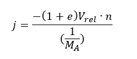

# Tutorial – Collision Resolution: Introduction

## Introduction and Objective:
In this tutorial we’re going to write a generic function to resolve collisions.

The math to do this is explained in the lecture slides for this session. We’ll implement this approach in code now, and in future lessons we’ll integrate this function into our existing application so that objects that collide can respond appropriately to those collisions.

## Prerequisites:
We will be using the DIY Physics engine that you have been writing.
Ensure you have completed the following tutorials:
- ***Fixed Timestep Tutorial. Available in the Introduction to Physics session.***
- ***Linear Force and Momentum Tutorial. Available in the Linear Force and Momentum session.***
- ***Collision Detection Tutorial. Available in the Collision Detection session.***
Although recommended, it is not necessary to have completed the following previous tutorials:
- ***Projectile Physics part 1: Analytical Solution. Available in the Projectile Physics session.***
- ***Projectile Physics part 2: Numerical Integration. Available in the Projectile Physics session.***

## Resolving a Collision:
The math explaining the formulas involved in collision resolution is explained in the lecture slides, but for our purposes we only need the final formula listed at the end of the lecture:


This formula calculates the impulse magnitude (j). In other words, j is the magnitude of the force vector that needs to be applied to our colliding objects.

To put this into practice, we multiply j by n (the collision normal) to determine the force to apply to each rigidbody. For one of these collision objects we’ll apply the positive force, and for the other we apply the negative force. 

When this force is applied to the collision object via the Rigidbody class’s applyForce() function, the force will be divided by the object’s mass to calculate the correct final velocity.

---

Define a new function for your Rigidbody class as follows:

``` c++
void ResolveCollision(Rigidbody* actor2);
```

This function only accepts another rigidbody as an argument. This means that our collision response algorithm will be fairly simple, at least for now. 

We aren’t, for example, taking into consideration the contact point. We also won’t account for any angular velocity of the two objects, or the effective mass. This will simplify our algorithm at the expense of physical realism. In later tutorials we’ll look at how we can improve the accuracy and realism of this function.

The implementation of this function is as follows:

``` c++
void Rigidbody::ResolveCollision(Rigidbody* actor2)
{
	glm::vec2 normal = glm::normalize(actor2->GetPosition() - m_position);
	glm::vec2 relativeVelocity = actor2->GetVelocity() - m_velocity;

	// if the objects are already moving apart, we don't need to do anything
	if (glm::dot(normal, relativeVelocity) >= 0)
		return;

	float elasticity = 1;
	float j = glm::dot(-(1 + elasticity) * (relativeVelocity), normal) / ((1/GetMass()) + (1/actor2->GetMass()));

	glm::vec2 force = normal * j;

    ApplyForceToActor(actor2, -force);
}
```

We start off by calculating the collision normal. In the image below, the collision normal is indicated by n. It is the normal of the plane along which the collision occurs (the dotted line).
 


In many physics engines this is usually returned by the collision detection function. Choosing a collision normal can be tricky. For the moment, just using circles, it will be sufficient to use the normalized difference in position (posB - posA). This is, in fact, what has been used in the image above.

After calculating the collision normal, we need the relative velocity between the two objects. To improve our physics engine we would want to determine the total velocity of both objects, which includes both linear and rotational velocity.

We then go ahead and calculate j as per our formula. Note that we are using a coefficient of elasticity (e) of 1. This means that no energy will be lost during the collision. 

If you wanted to model different physical materials, you could define values for each object and combine them to determine a coefficient of elasticity to use in your collision response algorithm, mimicking the way game engines like Unity3D work.

The line of code that calculates j (the impulse magnitude) is a bit long, but simply reflects the formula presented earlier. 

After calculating j, we multiply it by the collision normal (n). This gives us the force to apply to each object. This is done by calling the ApplyForceToActor() function we’ve previously written. (If you don’t have this function an explanation, if not the code, is given in the tutorial for Linear Force and Momentum.)

The ApplyForceToActor() function applies the negative force to this actor, and the positive force to actor2 (thus implementing the “equal and opposite” part of Newton’s third law).

We now have a collision resolution function that we can use to modify the velocities of the objects involved in a collision.
In the next tutorial we’ll cover how we can integrate this function into our exiting collision detection code, bringing the two systems together.

For now, explore the references and any web resources you find that explain similar approaches to collision resolution. Are there any improvements you can make to the function we just wrote?

## Next Tutorial:
Collision Resolution – Circle to Circle in Collision Response and Friction section

# Tutorial – Collision Response: Circle to Circle

## Introduction and Objective:
In this tutorial, we’ll combine the collision resolution function we wrote in the previous tutorial with our existing collision detection code so that we can simulate two circles colliding and bouncing off each other.

# Prerequisites:
We will be using the DIY Physics engine that you have been writing.
Ensure you have completed the following tutorials:
- ***Fixed Timestep Tutorial. Available in the Introduction to Physics session.***
- ***Linear Force and Momentum Tutorial. Available in the Linear Force and Momentum session.***
- ***Collision Detection Tutorial. Available in the Collision Detection session.***
- ***Collision Resolution: Introduction Tutorial. Available in the Collision Resolution session.***

Although recommended, it is not necessary to have completed the following previous tutorials:
- ***Projectile Physics part 1: Analytical Solution. Available in the Projectile Physics session.***
- ***Projectile Physics part 2: Numerical Integration. Available in the Projectile Physics session.***

## Circle-to-Circle Collision:
In the Collision Detection tutorial we implemented the *Circle2Circle()* function inside the PhysicsScene class to detect collisions between two circles.

``` c++
bool PhysicsScene::Circle2Circle(PhysicsObject* obj1, PhysicsObject* obj2)
{
	Circle *circle1 = dynamic_cast<Circle*>(obj1);
	Circle *circle2 = dynamic_cast<Circle*>(obj2);
	if (circle1 != nullptr && circle2 != nullptr) {
		glm::vec2 dist = circle1->GetPosition() - circle2->GetPosition();
		if (glm::length(dist) < circle1->GetRadius() + circle2->GetRadius()){
			// collision
			// for now, just stop the circles
			circle1->SetVelocity(glm::vec2(0, 0));
			circle2->SetVelocity(glm::vec2(0, 0));
			return true;
		}
	}
	return false;
}
```

Because we had yet to write the collision response function, when two circles collided we simply set the velocity of both circles to (0,0).

The *ResolveCollision()* function we added to the *Rigidbody* class during the last tutorial will modify the velocities of both circles in response to a collision event.


Update the *Circle2Circle()* function so that it calls the *ResolveCollision()* function on one of the circles, passing in the other circle as an argument.

## Kinetic Energy Diagnostics:
It can be difficult to visually diagnose whether a physics simulation is behaving correctly. It’s helpful at this stage to add some objective and unambiguous diagnostics.

With an elasticity of 1, our collision should conserve both momentum and kinetic energy. We are guaranteed to conserve momentum because we’re modifying the velocities using RigidBody::ApplyForceToActor. This applies equal and opposite forcers to the two bodies and thus conserves momentum. 

We should check that kinetic energy is also being preserved.

Add a virtual function to PhysicsObject, and an override to Rigidbody to calculate the kinetic energy. For now this will just be linear kinetic energy, calculated as Ek = ½ mv2

Use this function to calculate the kinetic energy before and after the collision, and check that the values are approximately equal. (There will be very small differences due to the limits of floating point accuracy.)

Here’s an example of checking the kinetic energy before and after a collision:

``` c++
void Rigidbody::ResolveCollision(Rigidbody* actor2)
{
	glm::vec2 normal = glm::normalize(actor2->GetPosition() - m_position);
	glm::vec2 relativeVelocity = actor2->GetVelocity() - m_velocity;

	// if the objects are already moving apart, we don't need to do anything
	if (glm::dot(normal, relativeVelocity) >= 0)
		return;

	float elasticity = 1;
	float j = glm::dot(-(1 + elasticity) * (relativeVelocity), normal) /
		((1 / m_mass) + (1 / actor2->GetMass()));

	glm::vec2 force = normal * j;

	float kePre = GetKineticEnergy() + actor2->GetKineticEnergy();

	applyForceToActor(actor2, -force);

	float kePost = GetKineticEnergy() + actor2->GetKineticEnergy();

	float deltaKE = kePost - kePre;
	if (deltaKE > kePost * 0.01f)
		std::cout << "Kinetic Energy discrepancy greater than 1% detected!!";
}
```

Later on in the tutorials, when we introduce variable elasticity, you’ll probably want to remove this check. But for now, it’s a good idea to build a “perfect” physics engine first with full elasticity and no friction, so that we can make sure that conservation of energy is being obeyed.

## Next Tutorial:
Collision Resolution – Circle to Plane in Collision Response and Friction section

# Tutorial – Collision Response: Circle to Plane

## Introduction and Objective:
In this tutorial, we’ll implement the circle-to-plane collision as described in the lecture for this session. At the end of this tutorial you should be able to create physics simulations involving circle-to-circle collisions and circle-to-plane collisions.

## Prerequisites:
We will be using the DIY Physics engine that you have been writing.
Ensure you have completed the following tutorials:
- ***Fixed Timestep Tutorial. Available in the Introduction to Physics session.***
- ***Linear Force and Momentum Tutorial. Available in the Linear Force and Momentum session.***
- ***Collision Detection Tutorial. Available in the Collision Detection session.***
- ***Collision Resolution: Introduction Tutorial. Available in the Collision Resolution session.***
- ***Collision Resolution: Circle-to-Circle Tutorial. Available in the Collision Resolution session.***

Although recommended, it is not necessary to have completed the following previous tutorials:
- ***Projectile Physics part 1: Analytical Solution. Available in the Projectile Physics session.***
- ***Projectile Physics part 2: Numerical Integration. Available in the Projectile Physics session.***

## Circle-to-Plane Collision:
Our approach for implementing circle-to-plane collisions will be slightly different to that for circle-to-circle collisions. The reason is that the planes in our physics engine are static – they won’t move in response to a collision.

Our existing collision resolution function, resolveCollision(), will modify the velocities of both objects involved in a collision. Obviously we don’t what this function to be modifying the velocity of the plane, as the plane itself is static.

But there is one more reason the existing resolveCollision() function isn’t appropriate in this instance. Because the plane is static, it will effectively have infinite mass. This means that we can optimise the formula used to calculate the final velocity of the circle.

As explained in the slides for this lecture, the formula to calculate the impulse magnitude (j) now becomes:



There are many different ways we could modify our program to handle collisions with static objects.

We could add more checks inside the existing resolveCollision() function, to see if any of the objects involved in the collision are static (or kinematic). We could remove the resolveCollision() function and just handle everything on a case-by-case basis inside each collision detection function. Or, as we’ll see now, we could create a different resolveCollison() function just for use with planes.

Inside the Plane class, create the following function:

``` c++
void Plane::ResolveCollision(Rigidbody* actor2)
{
}
```

You should be able to copy most of the logic for this function from the *Rigidbody::ResolveCollision()* function. In a circle-to-plane collision, we can use the plane’s normal as the collision normal.

Refer to the lecture slides and formula above to modify the calculation of the j variable in this function, or treat the plane’s mass as infinite, and work through eliminating terms (hint: the denominator simply becomes 1 over the mass of the circle).

To calculate the force, multiply j by the collision normal (i.e., the plane’s normal). This will give you the force to apply to the circle. You can call the circle’s *ApplyForce()* function, passing in this vector2 force value.

This should give you a complete *ResolveCollision()* function for the plane. The last step is to call this function from the circle-to-plane collision detection functions.

One thing to note is that because the Plane class does not inherit from the Rigidbody class, we can’t use virtual functions in this instance. We’ve simply made two functions in two classes that have the same name.

If you expect this to get a little confusing as you add more shapes to your physics engine, you may want to add the virtual function declaration to the PhysicsObject class. 

Go ahead and add one or more planes to your simulation. You should be able to create something in which circles collide with both planes and other circles. 

## Activity 1: Sphere to Sphere Lecture's Newton’s Cradle
The lecture slides for the Sphere to Sphere session discuss the collision between two balls of equal mass:
- One ball is stationary, and situated on the right hand side of the origin on the x-axis
- The other ball is moving at 1m/s along the x-axis, and is on the left hand side of the origin
- The coefficient of elasticity is 1
- Both balls weigh 1kg

Create a simulation that reproduces this problem. 

Run your simulation and use breakpoints to check if the velocities of your circles after the collision match the expected velocities in the worked problem in the lecture slides. The change the masses of the balls to verify that:
1. A heavy moving ball is not completely stopped when it hits a light ball
2. A light moving ball bounces back from a collision with a heavy ball

## Activity 2: Symmetrical Newton’s Cradle
Place two vertical planes as walls, and line up 5 perfectly elastic circles touching each other. Give the first one a velocity along the x-axis. You should observe Newton’s Cradle behaviour, with the balls on the left and right carrying all the momentum as they bounce back and forth into each other

## Activity 3: Asymmetrical Newton’s Cradle
Make one of the balls heavier and a different colour than the others. See what happens, and justify the behaviour to yourself in physical terms

## Kinetic and Potential Energy Diagnostics
You can now set up a simulation where a single fully-elastic bouncy ball is dropped on to a horizontal plane. The ball should bounce up and down, reaching the same height of apogee with each bounce.

In energy terms, we’re seeing an interchange between gravitational potential energy and linear kinetic energy. The ball has no kinetic energy when it reaches the top of its bounce, but being high up it has more gravitational potential energy. When it is at its lowest (hitting the floor) it has the least gravitational potential energy and the most kinetic energy.

Gravitational Potential Energy is expressed as 

**Eg = -mgh**

Where m = mass of the object, g is the gravitational field strength, and h is the height above the center of the gravitational field. We’re only interested in changes in potential energy, so we can use the Rigidbody’s position to get h.

Let’s put in some diagnostics for this.  We’ll need to access the gravity strength from the PhysicsScene, so we could make that variable and its public accessor static. (This will require a change to the PhysicScene constructor.) We can then add a GetPotentialEnergy() function to Rigidbody like so:

``` c++
float Rigidbody::GetPotentialEnergy()
{
	return -GetMass() * glm::dot(PhysicsScene::GetGravity(), GetPosition());
}

```

If you leave this running over lunchtime, or during a lecture, you’ll notice something odd – the ball keeps bouncing a little bit higher with each bounce!

We can put some hard unambiguous diagnostics into the PhysicsScene to calculate the total energy every frame to confirm this.

Put in a virtual GetEnergy() function into PhysicsObject that returns 0, and override it for Rigidbody to return the sum of kinetic and potential energy.

Use this to calculate the total energy in the scene:

``` c++
float PhysicsScene::GetTotalEnergy()
{
	float total = 0;
	for (auto it = m_actors.begin(); it != m_actors.end(); it++)
	{
		PhysicsObject* obj = *it;
		total += obj->GetEnergy();
	}
	return total;
}

```

Print this out every frame, and see what happens. As the ball bounces up and down, the total energy in the simulation rises very slowly.
Go back to the *Rigidbody::FixedUpdate* code and temporarily swap the order of the two lines around, so we apply gravity and then update the position. What happens to the total energy then?

It now decreases slowly!

What we’re observing here are limits of the simple forward-integration method we’re using. In reality, (or a simulation with an infinitesimally small timestep, the acceleration due to gravity happens gradually over 1/60th of a second. By dividing time up into discrete timesteps and applying the acceleration all at once, either at the start or the end of the timestep, we end up injecting or removing energy from the system.

This is not a huge problem for the type of simulations we’re making here. If we add a bit of extra energy in, we can remove it vis friction and drag later when we implement them. 

Commercial game engines use more sophisticated iterative solvers that don’t suffer from this problem, but are beyond the scope of this course to implement.

Make sure you revert your Rigidbody code to apply velocity to the position and then apply gravity. This is the better option because it makes resting objects behave more correctly, and we can counteract the addition of energy via friction.

## Testing the frame-smoothing code
We now have enough happening in our physics engine that we can test the frame smoothing code that we’ve written.

If you’ve got a Newton’s cradle or bouncing ball demo, see how it run when you increase the Physics timestep to give a cruder more coarse-grained simulation.

Change the physics timestep in PhysicsApp::startup() like so:

``` c++
m_physicsScene = new PhysicsScene();
m_physicsScene->SetTimeStep(0.1f);

```

This is a bit extreme – we’re only running 10 physics timesteps per second, and interpolating between them at draw time. Run like this and he behaviour should look reasonably smooth.

If you want a clearer look at what’s happening, add some temporary code to Circle::Draw which shows the previous and next frame

``` c++
void Circle::Draw(float alpha)
{
	CalculateSmoothedPosition(alpha);

	// draw the physics frames at half alpha
	glm::vec4 halfColor = m_color;
	halfColor.a = 0.5f;
	aie::Gizmos::add2DCircle(m_position, m_radius, 12, halfColor);
	aie::Gizmos::add2DCircle(m_lastPosition, m_radius, 12, halfColor);

	aie::Gizmos::add2DCircle(m_smoothedPosition, m_radius, 12, m_color);
}
```

You should be able to see shadows like on the right of the green ball here that move less smoothly than the full color versions.


Comment this extra draw code out for now if you want, and restore the physics timestep to 0.01f (100 FPS) for now, and we’ll move on to adding rotation in the next tutorial.

## Next Tutorial:
Rotational Force Part 1 in Rotational Force section


