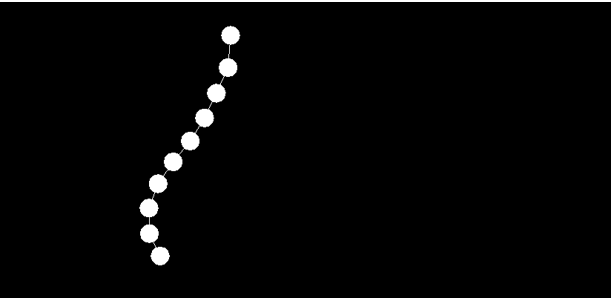

Tutorial – Springs

Introduction and Objective:
In this tutorial we'll demonstrate Hooke’s Law by adding spring joints to our custom 2D physics engine. 



## Prerequisites:
We will be using the DIY Physics engine that you have been writing.
Ensure you have completed the following tutorials:
- ***Fixed Timestep Tutorial. Available in the Introduction to Physics session.***
- ***Linear Force and Momentum Tutorial. Available in the Linear Force and Momentum session.***
- ***Collision Detection Tutorial. Available in the Collision Detection session.***
- ***Collision Resolution: Introduction Tutorial. Available in the Collision Resolution session.***
- ***Collision Resolution: Circle-to-Circle Tutorial. Available in the Collision Resolution session.***
- ***Collision Resolution: Circle-to-Plane Tutorial. Available in the Collision Resolution session.***
- ***Rotational Force, part 1. Available in the Rotational Force session.***
- ***Rotational Force, part 2. Available in the Rotational Force session.***
- ***Collision Resolution: Static and Dynamic Friction. Available in the Collision Resolution session.***
- ***Collision Resolution: Contact Forces. Available in the Contact Forces session.***
- ***Static and Dynamic Rigid Bodies. Available in the Static Rigid Bodies session.***

Although recommended, it is not necessary to have completed the following previous tutorials:
- ***Projectile Physics part 1: Analytical Solution. Available in the Projectile Physics session.***
- ***Projectile Physics part 2: Numerical Integration. Available in the Projectile Physics session.***

## Before We Begin:

We are going to add spring joints to the DIY engine. 

Begin by adding two balls to the scene. One ball should be flagged as static (kinematic).  

When you run the simulation one ball should fall and the other remain stationary. 

Remember to add gravity to your PhysicsScene. If your physics objects still aren’t falling under the force of gravity, this likely is related to the MIN_LINEAR_THRESHOLD value implemented in a previous tutorial. 

## The Spring Class:

We are going to join the balls together using a spring joint. Your Spring class can be derived from PhysicsObject. It will have the following members:

``` c++
Rigidbody* m_body1;
Rigidbody* m_body2;

glm::vec2 m_contact1;
glm::vec2 m_contact2;

glm::vec4 m_color

float m_damping;
float m_restLength;
float m_springCoefficient;		// the restoring force;
```

These variables describe which two bodies they connect, where they are attached on these bodies (or in world space if the body pointer is null), the ideal length between attachment points and the strength and damping of the restoring force.

In the Spring’s update function, we will check the distance between the attachment points and apply a restoring force to both bodies proportional to the difference between the actual distance and the rest length of the spring.

``` c++
void Spring::FixedUpdate(glm::vec2 gravity, float timeStep)
{
	// Get the world coordinates of the ends of the springs
	glm::vec2 p1 = GetContact1();
	glm::vec2 p2 = GetContact2();

	float length = glm::distance(p1, p2);
	glm::vec2 direction = glm::normalize(p2 - p1);

	// apply damping
	glm::vec2 relativeVelocity = m_body2->GetVelocity() - m_body1->GetVelocity();

	// F = -kX - bv
	glm::vec2 force = direction * m_springCoefficient * (m_restLength - length) - m_damping * relativeVelocity;

	m_body1->ApplyForce(-force * timeStep, p1 - m_body1->GetPosition());
	m_body2->ApplyForce(force * timeStep, p2 - m_body2->GetPosition());
}
```

The GetContact1() and GetContact2() functions used here will translate the contact points from the coordinate space of the Rigidbody (if there is one) to world space. We’ll need this functionality in several different places, so it makes sense to add these helper functions, and make sure to default their parameter equal to 1.f.

Their implementation is quite simple, using a ToWorld function that we’ll add to Rigidbody to translate from object space to world space.

``` c++
glm::vec2 Spring::GetContact1(float alpha) 
{ 
	return m_body1 ? m_body1->ToWorld(m_contact1, float alpha) : m_contact1; 
}
```

RigidBody:ToWorld() converts from local to world coordinates - this will simply be a matter of multiplying each component of the local position by the same local axis, and then adding the results to the object’s position (i.e., positon + localX * x + localY *y).

Going back to the Spring::FixedUpdate() function above, note that the force is being applied every timestep, so we need to multiply it by the timestep, unlike the single frame impulse forces of collision resolution. We also did this with gravity in Rigidbody::FixedUpdate().

Apart from the FixedUpdate() function, the only other function you will need to implement is the draw() function. To draw the joint, call the add2DLine() function to draw a line from the joint’s first connection point to its second, using GetContact1() and GetContact2().

You can implement the constructor however you like, but you will need to pass in all information to correctly configure your joint. The declaration below uses default parameters to make the class easier to use:

``` c++
class Spring : public PhysicsObject 
{
public:
	Spring(Rigidbody* body1, Rigidbody* body2, 
    float springCoefficient, float damping, float restLength,
    glm::vec2 contact1=glm::vec2(0, 0), glm::vec2 contact2=glm::vec2(0, 0) );
...
...
};
```

You can if you like have a default value for restLength of 0, and if this value is passed in you calculate restLength from the current length of the points on the Rigidbodies using GetContact1() and GetContact2().

If you do this, make sure that m_localX and m_localY are computed in the constructor, as they are required for GetContact1() and GetContact2() to work correctly. E.g make Rigidbody::CalculateAxes() public and write this in the Spring constructor:
``` c++
if (restLength == 0)
{
	if (m_body1) m_body1->CalculateAxes();
	if (m_body2) m_body2->CalculateAxes();
	m_restLength = glm::distance(GetContact1(), GetContact2());
}
```

---

## The Shape Type:
You will need to add the Joint enumerated value in the enum definition in the PhysicsObject header. 
``` c++
enum ShapeType
{
	JOINT = -1,
	PLANE = 0,
	SPHERE,
	BOX,
};

const int SHAPE_COUNT = 3;
```

At this point we'll use the CheckForCollision() function to make our code a bit easier to read, using the function after *accumulatedTime -= m_timeStep* and placing what was under it in the while loop into the CheckForCollision function.

Now if we assign all joints an enum value less than 0, then we can include some checks to exclude them from collision checks.

``` c++
void PhysicsScene::CheckForCollision() {
	int actorCount = m_actors.size();

	//need to check for collisions against all objects except this one.
	for (int outer = 0; outer < actorCount - 1; outer++)
	{
		for (int inner = outer + 1; inner < actorCount; inner++)
		{
			PhysicsObject* object1 = m_actors[outer];
			PhysicsObject* object2 = m_actors[inner];
			int shapeId1 = object1->GetShapeID();

			// this check will ensure we don't include any joints 
			// in the collision checks
			if (shapeId1 < 0 || shapeId2 < 0)
				continue;
...
...
		}
	}
}
```

The final piece is to give Spring a virtual draw() function. 

We want to draw a line from the contact points on the attached bodies using their smoothed positions and values.

Start by creating a ToWorldSmoothed(glm::vec2 localPos) function in Rigidbody that uses m_smoothedPosition, m_smoothedLocalX and m_smoothedLocalY  to get the world position. We can then call it from our Spring::draw function after calling CalculateSmoothedPosition() on the rigidbodies.

If either body is null, we just use the contact as a world position, and don’t need to worry about smoothing. Otherwise we calculate the smoothed position and then use that to transform to world coordinates.
``` c++
void Spring::Draw(float alpha)
{
	aie::Gizmos::add2DLine(GetContact1(alpha), GetContact2(alpha), m_color);
}
```

You’ll have to make CalculateSmoothedPosition() public at this point.

--- 

## Setting up the Scene:
To use the Spring class, instantiate a spring just after instantiating the balls created earlier, passing in pointers to the Rigidbody objects and the values for the rest length, spring constant and damping. The spring will need to be added to the PhysicsScene also.

We’ve already updated the collision handling to ignore collisions with the spring, but you might want to ignore collisions between all the balls in the chain as well, as this can help with stability.

Once you have completed the new classes and modified the collision detection routine you should be able to create the scene, instantiate two balls and a spring joint connecting them.  The free ball should bounce forever. If it doesn’t, then adjust the mass of the balls and the coefficient of friction until it works.

Once you have that working you can move onto creating a rope made out of balls and springs using code similar to the following:
``` c++
void PhysicsApp::Rope(int num)
{
	m_physicsScene->SetGravity(glm::vec2(0, -9.82f));

	Circle* prev = nullptr;
	for (int i = 0; i < num; i++)
	{
		// spawn a circle to the right and below the previous one, so that the whole rope acts under gravity and swings
		Circle* circle = new Circle(glm::vec2(i* 3, 30 - i * 5), glm::vec2(0), 10, 2, glm::vec4(1, 0, 0, 1));
		if (i == 0)
			circle->SetKinematic(true);
		m_physicsScene->AddActor(circle);
		if (prev)
			m_physicsScene->AddActor(new Spring(circle, prev, 500, 10, 7));
		prev = circle;
	}

	// add a kinematic box at an angle for the rope to drape over
	Box* box = new Box(glm::vec2(0, -20), glm::vec2(0), 0.3f, 20, 8, 2, glm::vec4(0,0,1,1));
	box->SetKinematic(true);
	m_physicsScene->AddActor(box);
}
```
You’ll need to add an orientation to the Box constructor after velocity for this code to compile, so that we can start the kinematic box at an angle.
A nice feature to add to your Spring class is the ability to pass in a restLength of zero, and have it calculate the rest length based on the initial distance between the contact points when this is the case.

---

## Activity 1: Experiment with Springs
- Experiment with different values for the spring constant, rest length and damping.  
Your simulation should work quite well but there might be some instability, particularly with longer chains.
- Experiment with anchoring the chain at several points and having several chains interacting with one another

## Next Tutorial (optional):
Soft Bodies in Joints and Springs


