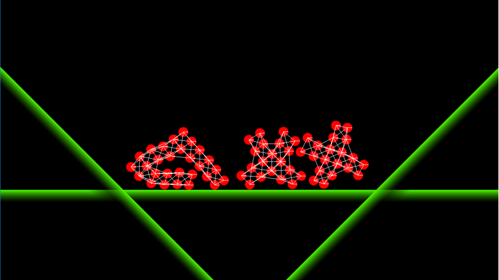

# Tutorial Bonus – Soft Bodies

## Introduction and Objective:
In this tutorial we'll used our Spring class to create more complex soft-body objects.



## Prerequisites:
We will be using the DIY Physics engine that you have been writing.
Ensure you have completed the following tutorials:
- ***Fixed Timestep Tutorial. Available in the Introduction to Physics session.***
- ***Linear Force and Momentum Tutorial. Available in the Linear Force and Momentum session.***
- ***Collision Detection Tutorial. Available in the Collision Detection session.***
- ***Collision Resolution: Introduction Tutorial. Available in the Collision Resolution session.***
- ***Collision Resolution: Circle-to-Circle Tutorial. Available in the Collision Resolution session.***
- ***Collision Resolution: Circle-to-Plane Tutorial. Available in the Collision Resolution session.***
- ***Rotational Force, part 1. Available in the Rotational Force session.***
- ***Rotational Force, part 2. Available in the Rotational Force session.***
- ***Collision Resolution: Static and Dynamic Friction. Available in the Collision Resolution session.***
- ***Collision Resolution: Contact Forces. Available in the Contact Forces session.***
- ***Static and Dynamic Rigid Bodies. Available in the Static Rigid Bodies session.***
- ***Springs. Available in the Joints and Springs session.***


Although recommended, it is not necessary to have completed the following previous tutorials:
- ***Projectile Physics part 1: Analytical Solution. Available in the Projectile Physics session.***
- ***Projectile Physics part 2: Numerical Integration. Available in the Projectile Physics session.***

## How to construct a SoftBody
The soft bodies we develop here are constructed from a grid of Rigidbodies (Circles usually) which are connected by springs to their immediate neighbours.

If we connect each body to its neighbours in the four grid direction, we end up with a very flaccid body that can collapse in on itself by shearing each square section.

Adding diagonal springs helps this significantly by preventing each box from shearing.
Adding “bend springs” that connect each body to its neighbours two bodies away in the grid directions further strengthens the body.

We’ll put together a SoftBody class that automatically creates all the Rigidbody and Spring objects and adds them into the scene.  

## The SoftBody Class
Create a SoftBody class with no base class (so NOT derived from PhysicsObject) and give it a static function where we can pass in the data required to build it.

The SoftBody class really is just this static function. We don’t have a SoftBody in the scene, just the Rigidbodies and Springs that it creates.
``` c++
class SoftBody
{
public:
	static void Build(PhysicsScene* scene, glm::vec2 position, float damping, float springForce, float spacing, std::vector<std::string>& strings);
};
```
We need to pass in the PhysicsScene, the position for the center of the SoftBody, the spacing between bodies that make it up, the springForce to apply to our springs, and an array of strings so we can feed it ASCII art to determine what the shape of the body is.

Here’s an example of creating the letter C from the title image of this tutorial.
``` c++
std::vector<std::string> sb;
sb.push_back("000000");
sb.push_back("000000");
sb.push_back("00....");
sb.push_back("00....");
sb.push_back("000000");
sb.push_back("000000");

SoftBody::Build(m_physicsScene, glm::vec2(-50, 0), 5.0f, 10.0f, 0.1f, sb);
```
To build the SoftBody we need to carry out the following steps:

1. Create a 2D array of Circles. Read the strings we’ve passed through and if the string shows a ‘’solid” character, ie ‘0’ instead of a period, we add a Circle to the Scene at that position.
2. Loop over our 2D array of Circles, and add a Spring between all neighbouring pairs. We need to do this with the cardinal neighbours, diagonal neighbours and finally the bend springs that span 2 circles in the cardinal directions. Each sp[ring we create should start at rest, so we calculate its restLength based on the distance between the two balls. 

First we create the circles and store them in an array based on the ASCII art provided.
``` c++
void SoftBody::Build(PhysicsScene* scene, glm::vec2 position, float damping, float springForce, float spacing, std::vector<std::string>& strings)
{
	int numColumns = strings.size();
	int numRows = strings[0].length();

	// traverse across the array and add balls where the ascii art says they should be
	Circle** circles = new Circle*[numRows* numColumns];
	for (int i = 0; i < numRows; i++)
	{
		for (int j = 0; j < numColumns; j++)
		{
			if (strings[j][i] == '0')
			{
				circles[i*numColumns + j] = new Circle(position + glm::vec2(i, j)*spacing, glm::vec2(0, 0), 1.0f, 2.0f, glm::vec4(1, 0, 0, 1));
				scene->AddActor(circles[i*numColumns + j]);
			}
			else
			{
				circles[i*numColumns + j] = nullptr;
			}
		}
	}
    ...
    ...
}
```

We have assumed here that the strings in the array provided are all of the same length. You can add your own error-checking in here to make this code more bulletproof against bad data.

We then need to step through this array and add in the springs. Note that we don’t want to add springs in twice, so we step over the entire array and look left and up to add the cardinal springs, rather than doing four checks per Circle.

Note that the for loops start at 1 rather than 0, because the first row and column do not have any other bodies to the left or up respectively.

It’s easiest to get pointers to the four circles in each square (s00, s01, s10 and s11) before adding springs in. Note that any of these could be null, depending on the shape we’ve passed in.
``` c++
// second pass - add springs in
for (int i = 1; i < numRows; i++)
{
	for (int j = 1; j < numColumns; j++)
	{
		Circle* s11 = circles[i*numColumns + j];
		Circle* s01 = circles[(i-1)*numColumns + j];
		Circle* s10 = circles[i*numColumns + j-1];
		Circle* s00 = circles[(i-1)*numColumns + j-1];
		
        // make springs to cardinal neighbours
		if (s11 && s01)
    		scene->AddActor(new Spring(s11, s01, damping, springForce, spacing));
		if (s11 && s10)
			scene->AddActor(new Spring(s11, s10, damping, springForce, spacing));
		if (s10 && s00)
			scene->AddActor(new Spring(s10, s00, damping, springForce, spacing));
		if (s01 && s00)
			scene->AddActor(new Spring(s01, s00, damping, springForce, spacing));
...
...
```

Test the code at this point by making a simple 4x4 array and dropping it on to a plane under gravity. You should get a very soft body that collapses in on itself because each square can shear into a diamond shape.

Adding diagonal springs is simply a case of checking if we can add a spring between s11 and s00, and another one between s01 and s10. Note that the restLength should be longer for these, diagonals, by a factor of sqrt(2.0f) unless you’ve added a feature to automatically calculate rest length.

Test this again, and see how the soft body becomes a lot more stable.

Finally, add in bend springs.

You’ll want to get some new circle pointers s22, s02 and s20. To find these, we need to make sure that we’re not looking off the edge of the array of circles.
``` c++
...
...

bool endOfJ = j == numColumns - 1;
bool endOfI = i == numRows - 1;

Circle* s22 = (!endOfI && !endOfJ) ? circles[(i+1)*numColumns + (j+1)] : nullptr;
Circle* s02 = !endOfJ ? circles[(i - 1)*numColumns + (j+1)] : nullptr;
Circle* s20 = !endOfI ? circles[(i+1)*numColumns + j - 1] : nullptr;

...
...
```

Then add springs between s00 and s02, s22 and s20, and so on, to have potentially another four springs. 

# Numerical Instability
When dealing with softbodies, you may encounter numerical instability for the first time. You may have already encountered it during the Springs tutorial.

Numerical instability occurs when the force involved in a simulation are too large for the timestep, and the approximation represented by the timestep starts to break down.

Consider two balls joined by a stretched spring. In the absence of external forces they should oscillate in simple harmonic motion. When the spring is stretched, it accelerates them together. When they hit rest length, they are moving together. They continue to move together, but are now decelerated as the spring compresses. And so on. There is an interchange between kinetic energy and potential energy in the spring.

If the spring is strong enough, it may accelerate the two bodies so that they move greater than the spring length on one timestep. They then end up with the spring even more stretched (in the opposite direction) and it tries to apply an even greater force to correct this. Very quickly, the whole simulation blows up.

If you encounter this, you can fix it by giving the spring a maximum force that it can exert.
``` c++
// F = -kX - bv
glm::vec2 force = direction * m_springCoefficient * (m_restLength - length) - m_damping * relativeVelocity;

// cap the spring force to 1000 N to prevent numerical instability
const float threshold = 1000.0f;
float forceMag = glm::length(force);
if (forceMag > threshold)
	force *= threshold / forceMag;

m_body1->ApplyForce(-force * timeStep, p1 - m_body1->GetPosition());
m_body2->ApplyForce(force * timeStep, p2 - m_body2->GetPosition());
```
Here, I’ve set a flat limit that the spring can only ever exert forces of 1000 Newtons. It would be preferable to base this limit on the spring coefficient and rest length of the spring.
If numerical instability does occur in your SoftBody, use this method to fix it. If you have time, come up with a better method for calculating this force cap that will work at all scales.
 
## Activity 1: Taking this further
- Test this with something simple like the bouncy “C++” letters in the opening image.
- Consider what else you can do with this, such as adding breaking force to springs. Maybe pass in more parameters like colours for the balls and springs.
- The springs currently all attach to the centre of the circles. What happens if you attach them to the edges? What about making a SoftBody out of Boxes, with springs attached to the edges or corners? What if the Boxes are square, or rectangular?

## Activity 2: Bouncing Names

Write out you first name using this system.

## Next Tutorial:
Making a Physics Game in Making a Physics Game


